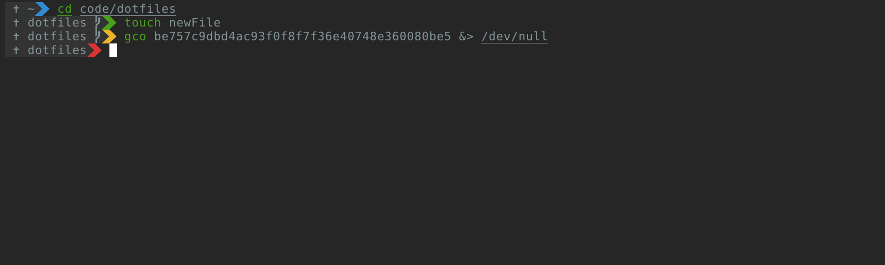

Simpalt
=====================

A ZSH theme based on [agnoster](https://github.com/agnoster/agnoster-zsh-theme) with focus on screen realstate

###### Demo
[](https://asciinema.org/a/gYRKD3Hdv9dvcZ6JiCyWlvhkM)

How to use it
---------------------

### Software Requirement
* [ZSH](https://www.zsh.org/)

### Supported frameworks
* [Vanilla ZSH](https://www.zsh.org/)
* [Oh My ZSH](https://github.com/robbyrussell/oh-my-zsh)
* [Prezto](https://github.com/sorin-ionescu/prezto)
* [ZGen](https://github.com/sorin-ionescu/prezto)
* [ZPlug](https://github.com/sorin-ionescu/prezto)

### Initial setup
```bash
$ brew install zsh
$ chsh -s $(which zsh)
```

Installing the theme
---------------------

#### Using ZGen
Add the following to your `.zshrc`
```bash
if ! zgen saved; then
  ...
  zgen load m-lima/simpalt simpalt.zsh-theme
  ...
  zgen save
fi
```

#### Using ZGen with Prezto
Add the following to your `.zshrc`
```bash
if ! zgen saved; then
  zgen prezto
  zgen prezto prompt theme 'simpalt'
  ...
  zgen load m-lima/simpalt
  ...
  zgen save
fi
```

#### Using ZPlug
Add the following to your `.zshrc`
```bash
zplug "m-lima/simpalt", as:theme
```

#### Using Oh My ZSH
Download the theme
```bash
$ cd ~/.oh-my-zsh/custom
$ git clone https://github.com/m-lima/simpalt
```
Add the following to your `.zshrc`
```bash
ZSH_THEME="simpalt"
```

#### Using vanilla ZSH
Download the theme
```bash
$ cd <whereever_you want_to_install>
$ git clone https://github.com/m-lima/simpalt
```
Add the following to your `.zshrc`
```bash
source <whereever_you want_to_install>/simpalt.zsh-theme
```

Options
---------------------

##### SIMPALT_SMALL
###### Controls the presentation of the prompt
If set to anything, the prompt will be presented in compact mode; otherwise, the full prompt will be presented.

##### SIMPALT_PROMPT_SEGMENTS
###### Set the prompt segments to be presented
This array will set all segments that compose the prompt

Available segments:
* prompt_aws
* prompt_status
* prompt_context
* prompt_virtualenv
* prompt_dir prompt_git

### Suggested setup
You can enable quick switch between compact and full mode by registering something similar to the following in your `.zshrc`
```bash
ts() { [ $SIMPALT_SMALL ] && unset SIMPALT_SMALL || SIMPALT_SMALL=1 }
```
Then, just use the `ts` command to swtich between prompt styles

